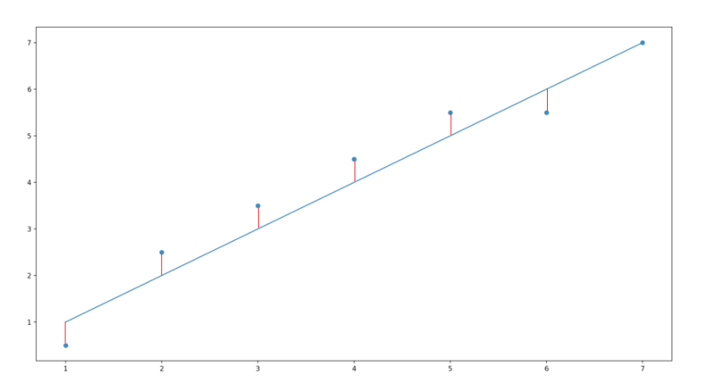
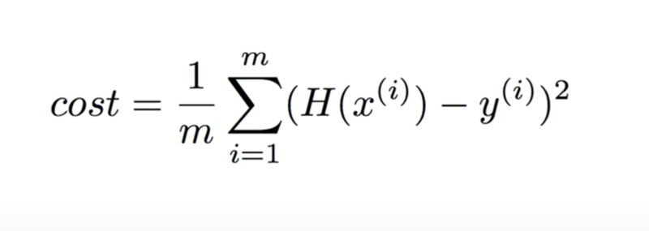
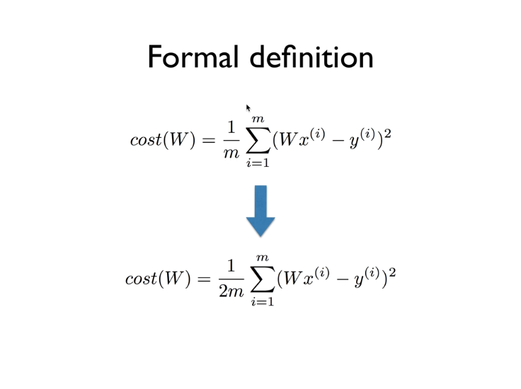
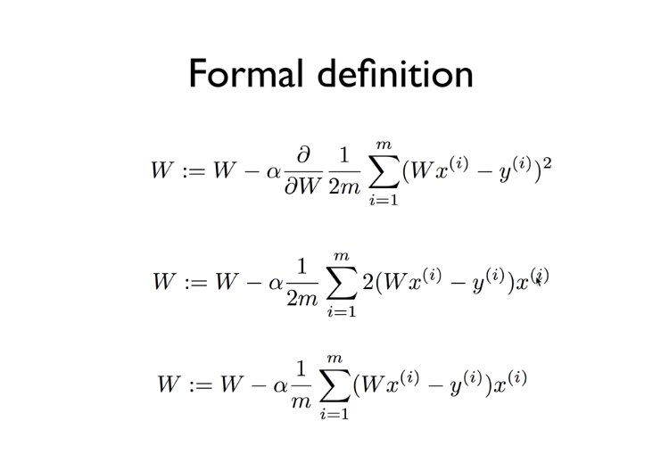
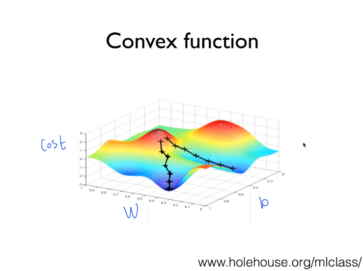
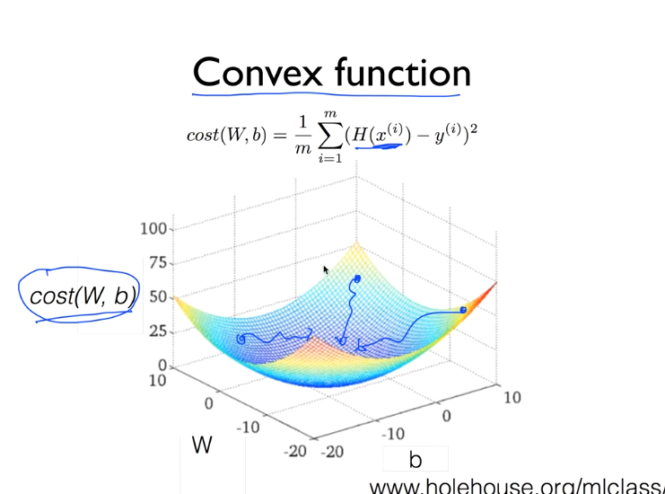

# Linear Regression

## Concepts

### Predicting exam score: regression

| x (hours) | y (score) |
| --------- | --------- |
| 10        | 90        |
| 9         | 80        |
| 3         | 50        |
| 2         | 30        |

> 종속 변수 **y** 와 한 개 이상의 독립 변수 **x** 와의 선형 상관 관계를 모델링하는 회귀분석 기법
>
> > H(x) = Wx + b
>
> - 한 개의 설명 변수에 기반한 경우 **단순 선형 회귀**
> - 둘 이상의 설명 변수에 기반한 경우 **다중 선형 회귀**
>
> 선형 회귀는 선형 예측 함수를 사용해 회귀식을 모델링하며, 알려지지 않은 파라미터의 경우 데이터로부터 추정한다. 이렇게 만들어진 회귀식을 **선형 모델** 이라고 정의한다.

#### Cost (Loss) Function

> How fit the line to our training data
>
> H(x) - y

W, b 값이 학습 데이터를 얼마나 잘 표현하는지를 계량하기 위해 Cost Function을 이용.





> #### Goal
>
> > Minimize cost(W,b)


## Materialization with Tensorflow

```python
import tensorflow as tf

# X and Y data
x_train = [1, 2, 3]
y_train = [1, 2, 3]

W = tf.Variable(tf.random_normal([1]), name='weight')
b = tf.Variable(tf.random_normal([1]), name='bias')

# Our hypothesis Wx+b
hypothesis = W * x_train + b

# Cost (Loss) Function
cost = tf.reduce_mean(tf.square(hypothesis - y_train))
```

> #### **GradientDescent**
>
> ```python
> # Minimize
> optimizer = tf.train.GradientDescentOptimizer(learning_rate=0.01)
> train = optimizer.minimize(cost)
> ```

```python
# Launch the graph in a session.
sess = tf.Session()
# Initialized global variables in the graph.
sess.run(tf.global_variables_initializer())

# Fit the line
for step in range(2001):
  sess.run(train)
  if step % 20 == 0:
    print(step, sess.run(cost), sess.run(W), sess.run(b))
```

> #### Using Placeholder
>
> ```python
> X = tf.placeholder(tf.float32, shape=[None])
> Y = tf.placeholder(tf.float32, shape=[None])
> 
> for step in range(2001):
>   cost_val, W_val, b_val, _ = sess.run([cost, W, b, train], feed_dict={X: [1,2,3], Y: [1,2,3]})
>   if step % 20 == 0:
>     print(step, cost_val, W_val, b_val)
> ```
>
> 


## Gradient Descent Algorithm

- **Minimize** cost function
- Gradient Descent is used in many minimization problems
- For a given cost function, cost (W,b), it'll find W, b to minimize cost
- It can be applied to more general function: cost (w1, w2, ...)

### How it works

- Start with initial guesses
  - Start at 0,0 (or any other value)
  - Keeping changing W and b a little bit to try and reduce cost (W, b)
- Each time you change the parameters, you select the gradient which reduces cost(W,b) the most possible
- Repeat
- Do so until you converge to a local minimum
- Has an interesting property
  - Where you start can determine which minimum you end up

### Formal Definition





> ⍺ = (learning_rate) = (Constant)
>
> if (Gradient) is positive, W will be descreased, otherwise W will be increased.




> If the cost function is the same as above, the minimize portion depends on the starting point, i.e. the algorithm doesn't function properly.



> Gradient Descent Algorithm is always be satisfied if cost function is same as convex function.

### Materialization

```python
import tensorflow as tf
import matplotlib.pyplot as plt

X = [1, 2, 3]
Y = [1, 2, 3]

W = tf.placeholder(tf.float32)

# Our hypothesis for linear model X * W
hypothesis = X * W

# Cost function
cost = tf.reduce_mean(tf.square(hypothesis - Y))
sess = tf.Session()

# Initializes global variables in the graph.
sess.run(tf.global_variables_initializer())

# Variables for plotting cost function
W_val = []
cost_val = []
for i in range(-30, 50):
  feed_W = i * 0.1
  curr_cost, curr_W = sess.run([cost, W], feed_dict={ W: feed_W })
  W_val.append(curr_W)
  cost_val.append(curr_cost)

# Show the cost function
plt.plot(W_val, cost_val)
plt.show()
```

> #### Minimization of Cost Function
>
> ```python
> learning_rate = 0.1
> gradient = tf.reduce_mean((W * X - Y) * X)
> descent = W - learning_rate * gradient
> update = W.assign(descent)
> ```

#### Application of Minimization of Cost Function

```python
import tensorflow as tf

X_data = [1, 2, 3]
Y_data = [1, 2, 3]

W = tf.Variable(tf.random_normal([1]), name='weight')
X = tf.placeholder(tf.float32)
Y = tf.placeholder(tf.float32)

# Our hypothesis for linear model X * W
hypothesis = X * W

# Cost Function
cost = tf.reduce_sum(tf.square(hypothesis - Y))

# Minimize: Gradient Descent using derivative: W -= learning_rate * derivative
learning_rate = 0.1
gradient = tf.reduce_mean((W * X - Y) * X)
descent = W - learning_rate * gradient
update = W.assign(descent)

# Launch the graph in a session.
sess = tf.Session()

# Initializes global variables in the graph.
sess.run(tf.global_variables_initializer())
for step in range(21):
  sess.run(update, feed_dict={ X: X_data, Y: Y_data })
  print(step, sess.run(cost, feed_dict={ X: X_data, Y: Y_data }), sess.run(W))
```

> #### Manual Gradient
>
> ```python
> import tensorflow as tf
> 
> X_data = [1, 2, 3]
> Y_data = [1, 2, 3]
> 
> W = tf.Variable(5.)
> X = tf.placeholder(tf.float32)
> Y = tf.placeholder(tf.float32)
> 
> # Our hypothesis for linear model X * W
> hypothesis = X * W
> gradient = tf.reduce_mean((W * X - Y) * X) * 2
> 
> # Cost Function
> cost = tf.reduce_mean(tf.square(hypothesis - Y))
> optimizer = tf.train.GradientDescentOptimizer(learning_rate=0.01)
> 
> # Get gradients
> gvs = optimizer.compute_gradients(cost)
> # Apply gradients
> apply_gradients = optimizer.apply_gradients(gvs)
> 
> # Launch the graph in a session.
> sess = tf.Session()
> 
> # Initializes global variables in the graph.
> sess.run(tf.global_variables_initializer())
> 
> for step in range(100):
>   print(step, sess.run([gradient, W, gvs]))
>   sess.run(apply_gradients)
> ```


## Multi-variable

### Hypothesis

- H(x1, x2, …, xn) = w1x1 + w2x2 + … + wnxn + b

#### Using matrix

- H(X) = X(horizontal) * W(vertical)

### Cost Function

- Same as Hypothesis

### Materializtaion

```python
import tensorflow as tf

X_data = [[73., 80., 75.], [93., 88., 93.], [89., 91., 90.], [96., 98., 100.], [73., 66., 70.]]
Y_data = [[152.], [185.], [180.], [196.], [142.]]

X = tf.placeholder(tf.float32, shape=[None, 3])
Y = tf.placeholder(tf.float32, shape=[None, 1])

W = tf.Variable(tf.random_normal([3,1]), name='weight')
b = tf.Variable(tf.random_normal([1]), name='bias')

# Hypothesis
hypothesis = tf.matmul(X, W) + b

# Simplified Cost Function
cost = tf.reduce_mean(tf.square(hypothesis - Y))

# Minimize
optimizer = tf.train.GradientDescentOptimizer(learning_rate=1e-5)
train = optimizer.minimize(cost)

# Launch the graph in a session.
sess = tf.Session()
# Initializes global variables in the graph.
sess.run(tf.global_variables_initializer())

for step in range(2001):
  cost_val, hy_val, _ = sess.run([cost, hypothesis, train], feed_dict={ X: X_data, Y: Y_data })
  if step % 10 == 0:
    print(step, f"Cost: {cost_val}", f"\nPrediction:\n{hy_val}")
```

